### DESK+  

收纳不难，你只是缺一个神器

----

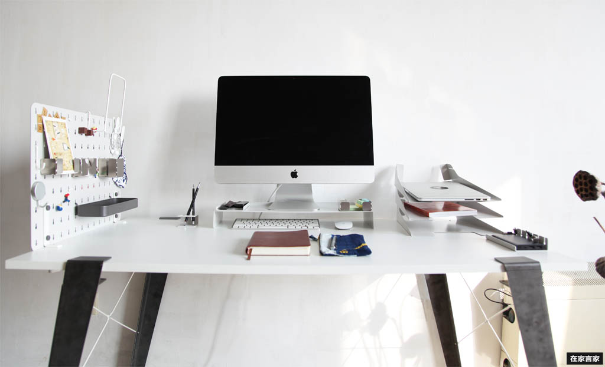

**一个难解的问题:**   
经过慎重的自我审视，小库觉得自己同时患上了两种相互矛盾的病症——拖延症和强迫症！

大多数时候都是拖延症，各种物件儿乱七八糟的堆放在一起，还理直气壮地叫嚣着“我的天哪，怎么这么乱呀？！”。本着能拖一天是一天的原则，直到不收拾就找不到东西的时候，另一种病症就开始发作了……

下定决心，收拾一下吧，强迫症就开始了，“一定要摆放整齐，一定要节省空间，一定要好存好取，一定要……”这些想法支配着接下来的操作，然后，就没有然后了……强迫症似乎自愈了，又开始了下一轮的拖延……

看到没，这是个死圈儿啊！！！打破这个循环的圈圈，拯救凌乱，ikuku的创始人马海东推出了一套桌面收纳神器，让我们先从拯救桌面开始吧~

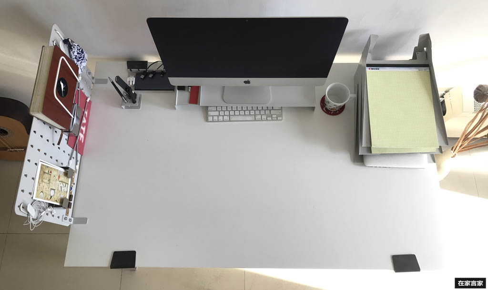

**你需要的只是一个神器而已:**   
工作桌面是设计师的第二个家，作为电子产品的重度使用患者，设计师的桌面到处数据线设计稿到处都是。看到杂乱的桌面，心情就烦躁，根本没法静心工作学习。这简直是个死循环。还好ikuku针对设计及创意工作者的工作习惯推出了一套桌面收纳神器，工作学习好心情从拯救桌面开始。

### 第一步: 小空间，大延伸（2D空间变3D空间）

买张大桌子能解决以上问题吗？   
不懂收纳的话，再大的2D平面空间也有用完的时候。  
空间延伸我们把**2D变成了3D**。

**1. 立面空间： 洞洞板 + 垃圾袋挂钩**  

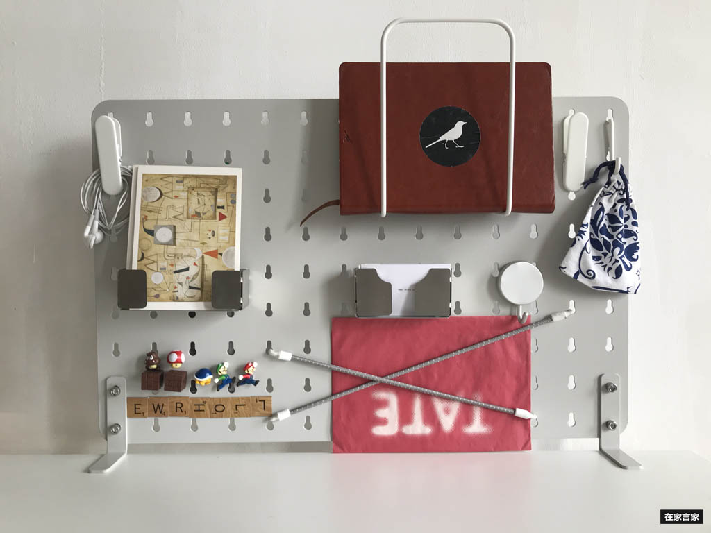

**洞洞板:** 无需打孔，只要两个螺钉，即可固定在桌边，通体金属不但耐用抗刮磨,而且配合磁贴可以任意摆放.  
能上墙的物件儿绝不躺在桌上。产品设计上考虑到与宜家产品完美兼容，根据需求自由组合成自己更适用的收纳板。

立面收纳，可以大体分为常用和较常用两个区域，常用区域靠近手边，方便存取。配合挂钩使用，耳机、剪刀等都可以直接挂上去。配合收纳盒使用，名片、信件、文具等都可以上墙。

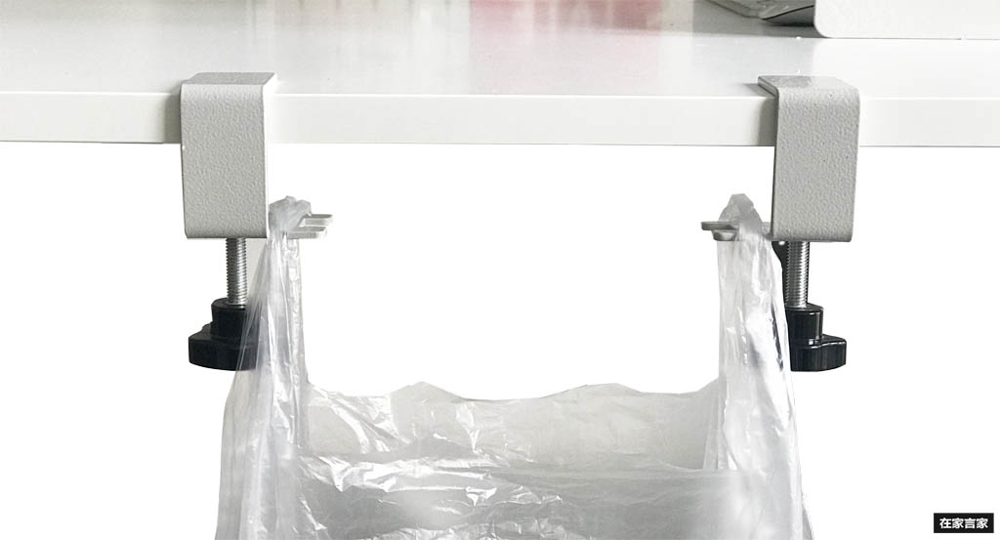

**垃圾袋挂钩**   久坐之后放松双腿却把垃圾桶踢倒，这样的经历相信大家都有过。垃圾袋悬挂在桌边，桌面打扫、扔垃圾都可以更快捷方便。无需打孔，充分利用立体空间。

**2. 桌面空间： 显示器增高架 +  多层文件收纳架**  

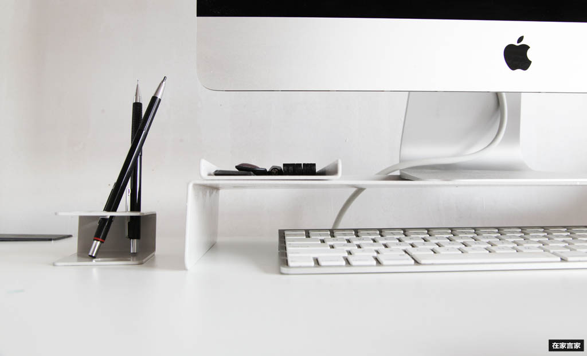

**显示器增高架:** 将显示器抬高5.5cm，下层大空间可以收纳键盘、鼠标、甚至笔记本。上层空间可以摆放手机、便利贴、尺笔等，实现桌面收纳空间和工作空间的延伸。  
设计师的一个小心机值得一提，在上层空间的背面做了折边，是物品收纳摆放的位置标尺，也可防止掉落。

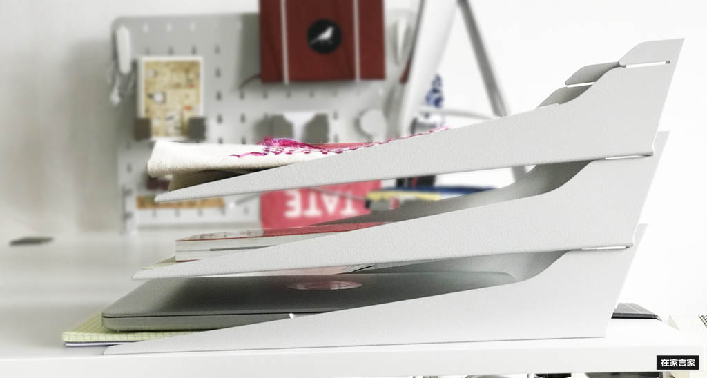

**多层文件收纳架:**  每层都是通过槽口卡装，稳定牢固。单层长340mm，宽220mm，高60mm，容量很大，能收纳笔记本、文件夹、图书杂志等。可以根据需求多层自由组合，增加收纳空间。

**3. 桌底空间：插座电线收纳/集线器**    

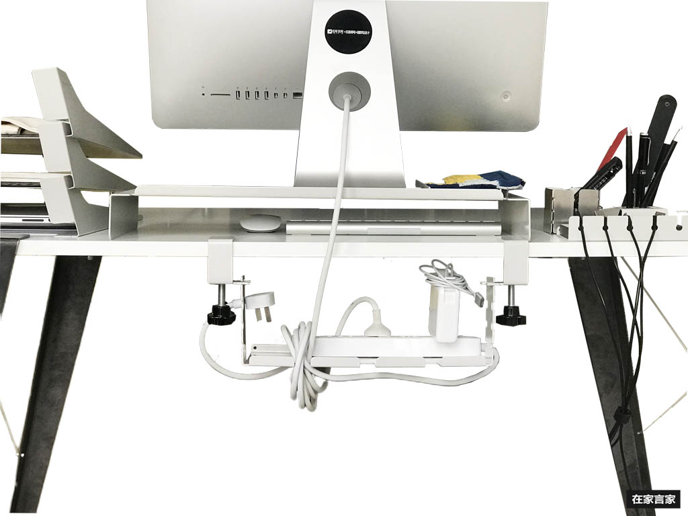

一个集线板理线器解决所有问题: 开放式设计,高效散热, 两颗螺钉手动拧紧完成安装。   
桌底主要是电线、插排、路由器的收纳，线路可根据需求自由缠绕，轻松掌控长短,不再踩线，桌底空间也可以很整洁。  
同时由于两边卡槽可以放置插线头，也解放了桌面空间。 

### 第二步：便于取放,用完归位不难

完成第一步，我们就有了足够的发挥空间，接下来就是对各类物件儿分类整理，可以根据**功能**及**尺寸**分类，同时也可以根据**使用频率**分类.。   
原则就是便于取放，用完容易归位。

**1. 线材**  

显得最乱的就是线材。表现为:  
* 电源线
* 手机充电器(手机，充电宝,适配器)
* 耳机线
* 笔记本电脑的充电线、移动硬盘的数据线...

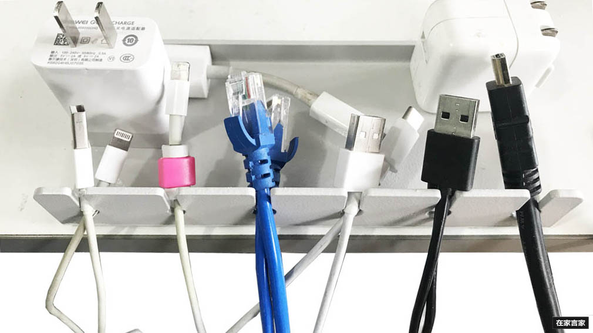

<u>高频率神器: 桌面理线器</u>  
对于取放频率高的线材，ikuku配合桌底集线板理线器提供了桌面理线器  
这款理线器共有6个大小不同的理线孔，可以适用于直径在5mm以内的各种线材，如数据线、耳机线、网线、鼠标线、音箱线等。  
特别设计的收纳槽，可以同时收纳手机、充电宝、充电器插头等。相比市面上其他材质的类似产品，需要双面胶粘贴在桌面上使用，这款产品的自身重量，使其可以直接放置在桌面使用，方便整理， 方便取放。

对于取放频率低的，可以将线材上墙，挂在洞洞板上。

**2. 文具**  

除了尺笔、名片、信件、便利贴等，文具种类及其繁多。  
根据尺寸大小及使用频率,ikuku 提供了3种套装。 

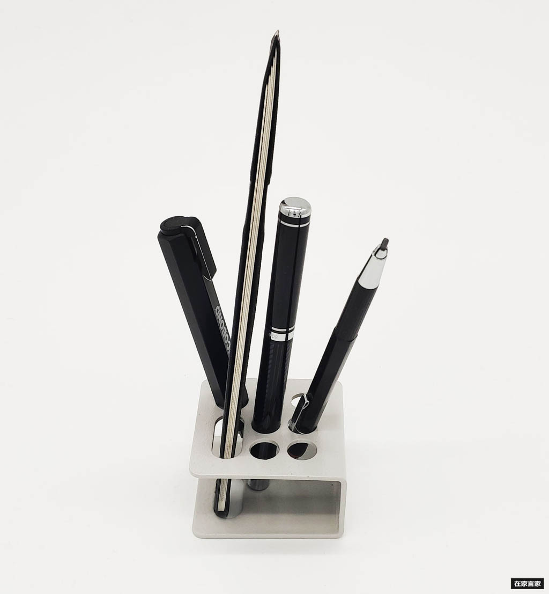

<u>高频率套装一: 尺笔收纳托架</u>  

经常使用的的尺笔，ikuku提供了尺笔收纳托架，共有8个插孔，包含7个大小不同的圆形插孔，可以收纳多种尺寸的笔。其中一个椭圆形插孔，可以收纳美工刀、尺子等。相比市面上筒式收纳，我们合理控制了高频率使用物件的数量,只有经常使用的物件才出现在这个收纳器里面。 而不经常使用的可以挪到低频率套装二或套装三里面。

<u>低频率套装二: 折纸式小物件收纳盒套件</u>  
不是经常使用但是又必须出现在桌面上的物件， 我们提供了4款大小不一的盒式收纳。 轻松搞定名片，明信片，信件，便利贴.几款收纳盒子配合使用，保持桌面清洁。   
这一套装的设计除了可以在桌面上自由移动， 也可以上墙挂在洞洞板上。 

<u>低频率套装三: 文具/杂物收纳托盘</u>  
对于不适合套装二尺寸的低频率的文具， ikuku提供了长条形收纳板可2D展开, 里面的物件轻松可以找到。   
物件包括手机、管状条状的尺笔文具、以及各种极小尺寸的小物件。 

------

### Desk++产品信息表

讲了这么多收纳，也推荐了不少神器，有没有手痒想试试？行动永远都不晚呢~  
小库等你晒出自己的收纳成果喔~  

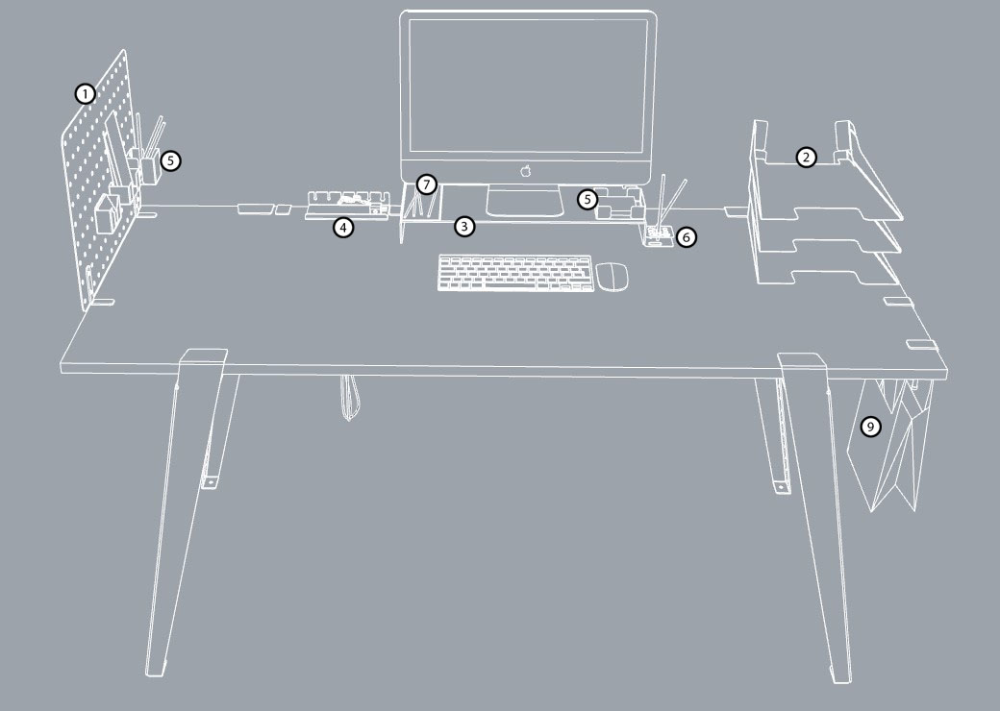
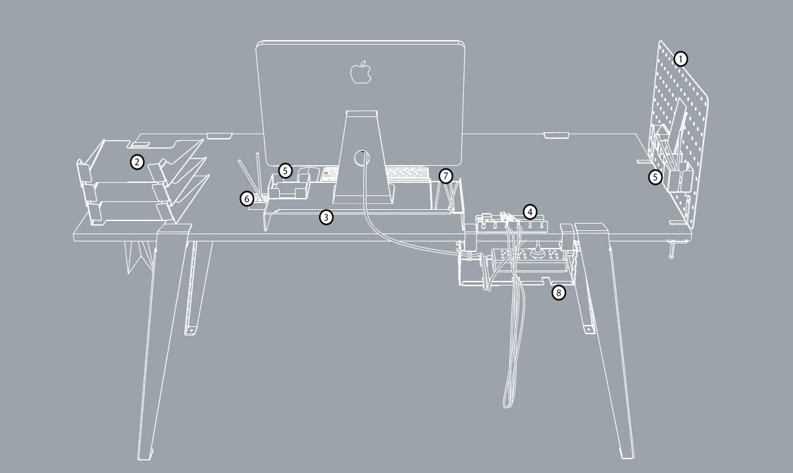
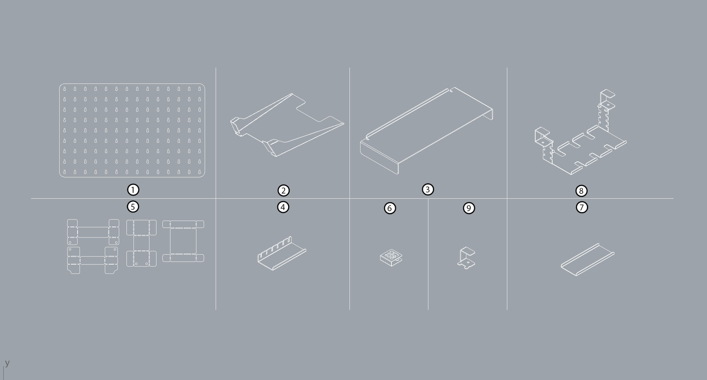

材质: 金属材质  
设计师：马海东(ikuku创始人)  

**洞洞板:**  
* 编号: D01
* 尺寸: 560mmX360mm
* 配件可轻松固定在洞洞板的任何位置，且易于移动。
* 可配合挂钩(磁性/非磁性)，耳机、剪刀等都可以挂起来。  
* 可配合弹性挂线，可存放纸张,三角板等
* 可配合Desk++收纳盒使用，名片、信件、文具等都可以挂起来。
* 完美兼容宜家产品。

**多层文件收纳架：**  
* 编号: D02
* 尺寸: A4X60mm
* 每层之间通过槽口卡装，稳定牢固。
* 单层容量很大，能收纳A4纸张，笔记本、文件夹、图书杂志等。
* 两层之间为60mm,可以根据自己的空间容量的需求,选择2层、3层或更多层自由组合。

**显示器增高架:**  
* 编号: D03
* 尺寸: 510mmX205mmX50mm
* 下层大空间可以收纳键盘、鼠标等, 也可以被用来收纳笔记本电脑。
* 上层空间除了放置显示器，还可以收纳手机、便利贴、尺笔等。
* 上层空间的背面做了折边，是物品收纳摆放整齐的位置标尺，也可防止掉落。

**插座电线收纳/集线器:**  
* 编号: D08
* 尺寸: 150mmX150mmX300mm
* 每层之间通过槽口卡装，稳定牢固。
* 开放式设计，高效通风散热。
* 两颗螺钉手动拧紧完成安装。  
* 线路可根据需求自由缠绕，轻松掌控长短。  
* 两边卡槽可以放置闲置的插线头。

**桌面理线器:**  
* 编号: D04
* 尺寸: 180mmX80mm
* 6个大小不同的理线孔，可以适用于直径在5mm以内的各种线材，如数据线、耳机线、网线、鼠标线、音箱线等。
* 特别设计了收纳槽，可以收纳手机、充电宝、充电器插头等，对相关物品进行归类收纳，便于存取。
* 金属材质, 产品的自重使其可以直接放置在桌面使用，不需要双面胶粘贴，方便整理、清洁。

**尺笔收纳托架:**  
* 编号: D06
* 尺寸: 60mmX60mmX20mm
* 共7+1个插孔  
* 其中7个大小不同的圆形插孔，可以收纳多种尺寸的笔；
* 1个椭圆形插孔，可以收纳美工刀、尺子等。

**折纸式小物件收纳盒套件:**  
* 编号: D05
* 金属材质，表面拉丝打磨。
* 用途:名片/信件/便利贴/刀尺工具等的收纳
* 设计成折纸的样式，需要使用者参与到产品最后完成阶段，手动折叠成最终产品，折叠的完成度决定了产品的唯一性。
* 可配合Desk++洞洞板使用。

**文具/杂物收纳托盘:**  
* 编号: D07
* 尺寸: 200mmX80mm
* 可存放各类办公用品及杂物。

**垃圾袋挂钩**  
* 编号: D09
* 两颗螺钉手动拧紧完成安装。  
* 可以钩挂不同尺寸手提式垃圾袋。

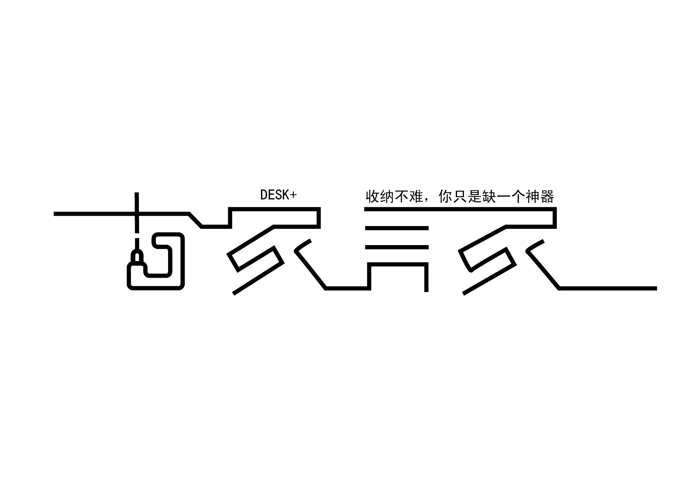

[点击立马可领取优惠券!](https://www.mikecrm.com)
